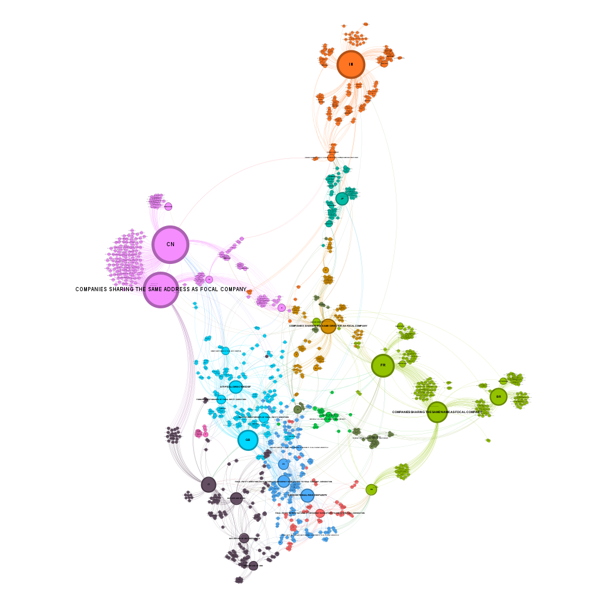
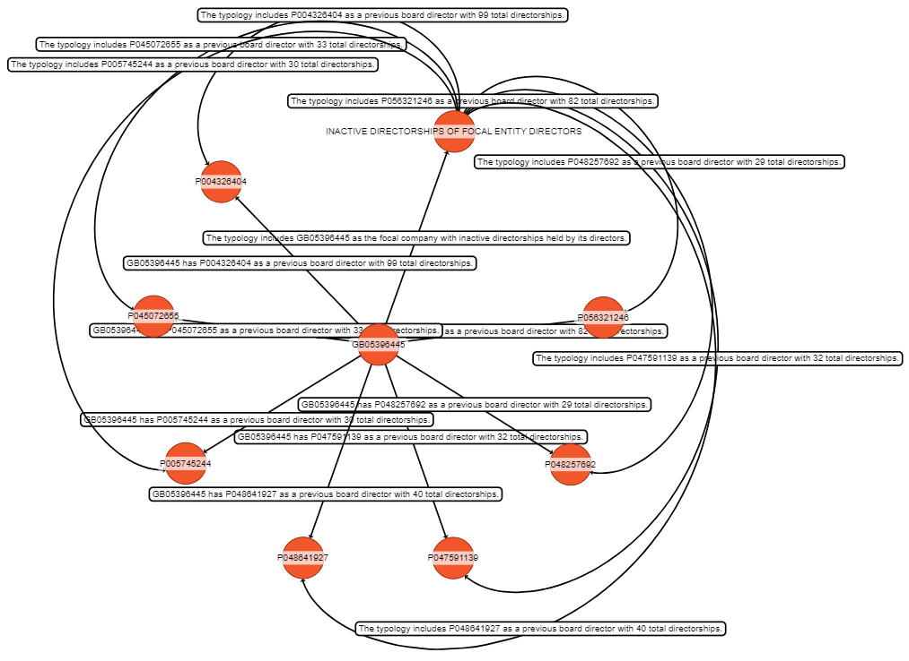

# GraphRAG Project README
This repository contains the documentation and code for a project that applies **GraphRAG** to assist fraud detection, particularly shell companies, using a private dataset from Moody's called Shell Company Indicator.
The project builds a financial knowledge graph, enables rapid querying, and visualizes risk patterns, aiming to support users in fraud detection.

## Requirements
- **Python**: 3.10–3.12
- **GraphRAG**: 2.0.0
- Optional: Install Gephi for graph visualization
  
## Getting Started
To set up and run this project, follow these steps.

### Step 1: Install GraphRAG
Install the GraphRAG package via pip:

```
pip install graphrag==2.0.0
```

The `graphrag` library provides a CLI for a no-code approach. Refer to the [official CLI documentation](https://github.com/microsoft/graphrag/blob/main/docs/cli.md) for more details.

### Step 2: Prepare the Dataset
Create a directory for the input data:

```
mkdir -p ./ragtest/input
```

Place input files in the `./ragtest/input` folder. Only two file formats are accepted:
- **Plain text files** (`.txt`)
- **CSV files** (`.csv`) – Must include columns like "Source" and "Text" (see configuration details below).

For this project, we used a small subset of SCI records. Data was processed into a single CSV file with relevant columns merged. Data processing scripts are provided in the data processiing/ folder.

Due to data confidentiality, we only provide a sample_input.csv under sample input/.

### Step 3: Initialize the Workspace
Initialize a GraphRAG project:
```
graphrag init --root ./ragtest
```

This creates two files in the `./ragtest` directory:
- `.env`: Contains environment variables (e.g., `GRAPHRAG_API_KEY=<YOUR_OPENAI_API_KEY>`). Update this with your OpenAI API key.
- `settings.yaml`: Pipeline configuration file (see customization details below).

#### Configuring `settings.yaml`
The `settings.yaml` file allows to customize the pipeline, including the model and input type. Below are key modifications:

- **Model and Parameters**: Adjust the `llm` section to specify desired model (e.g., `gpt-4`) and parameters (e.g., chunk size). Example:

  ```yaml
  models:
    model: gpt-4o
    tokens_per_minute: 150_000
    requests_per_minute: 10_000
    ...
  ```

- **CSV Input**: If using a CSV file instead of the default `.txt`, update the `input` section. GraphRAG will only read the `Text' column for graph creation:

  ```yaml
  input:
    type: file
    file_type: csv
    base_dir: "input"
    file_encoding: utf-8
    file_pattern: ".*\\.csv$"
    source_column: "Source"
    text_column: "Text"  # Required: GraphRAG processes this column
  ```

- **Graph Visualization**: To enable graph visualization (disabled by default), set:

  ```yaml
  snapshots:
    graphml: true
  ```

Review and modify `settings.yaml` as needed.

### Step 4: Prompt Tuning
Before running the indexing pipeline, you can tune the prompts to improve the knowledge graph generation. For this project, we tuned prompts to make GraphRAG fit SCI data better.

GraphRAG offers default prompts, auto-tuning, and manual tuning options. Auto-tuning is recommended for better results tailored to the data.

#### Auto Prompt Tuning
Run the auto-tuning script to generate domain-adapted prompts (optional but encouraged):

```
graphrag prompt-tune --root ./ragtest --config ./ragtest/settings.yaml

```

This uses default settings to process your input data and generate prompts in the `./ragtest/prompts` folder. For custom settings (e.g., domain or chunk size), use:

```
graphrag prompt-tune --root ./ragtest --config ./ragtest/settings.yaml --domain "your_domain" --chunk-size 256 --max-tokens 2048
```

Key options:
- `--domain`: Specify your data’s domain (e.g., "environmental news"). If omitted, it’s inferred from the data.
- `--selection-method`: Choose `random` (default), `top`, `all`, or `auto` for text unit selection.
- `--limit`: Limit text units (default: 15) for `random` or `top` methods.
- `--chunk-size`: Token size for text units (default: 200).
- `--output`: Folder for generated prompts (default: "prompts").

See the [Auto Tuning documentation](https://microsoft.github.io/graphrag/prompt_tuning/auto_prompt_tuning/) for more details.

#### Manual Prompt Tuning
For advanced customization, edit the prompt files directly in the `prompts` folder:
- Entity/Relationship Extraction: `extract_graph.txt`
- Summarize Descriptions: `summarize_descriptions.txt`
- Claim Extraction: `extract_claims.txt`
- Community Reports: `community_report_text.txt`

**Note**: These file names are specific to GraphRAG 2.0.0. Earlier versions may use different names.

Refer to the [Manual Tuning documentation](https://microsoft.github.io/graphrag/prompt_tuning/manual_prompt_tuning/) for token details and customization.

The default prompts are under prompts/.

### Step 5: Run the Indexing Pipeline
Execute the indexing pipeline:

```
graphrag index --root ./ragtest
```

This process may take time depending on the dataset size. Once complete, check the `./ragtest/output` folder for generated parquet files and, if enabled, a `merged_graph.graphml` file for visualization.

### Step 6: Query the Indexed Data
#### Method 1: Use CLI
Directly use the GraphRAG CLI to query the indexed graph. Examples:

- **Global Search** (high-level themes):

  ```
  graphrag query ^
  --root ./ragtest ^
  --method global ^
  --query "Summarize all methodologies for identifying shell companies. Additionally, identify and describe any new risk patterns associated with     shell companies."
  ```

- **Local Search** (specific details):

  ```
  python -m graphrag.query ^
  --root ./ragtest ^
  --method local ^
  --query "Tell me about Palladia Limited."
  ```

- **Drift Search** (combine global and local):

  ```
  python -m graphrag.query ^
  --root ./ragtest ^
  --method drift ^
  --query "Summarize all methodologies for identifying shell companies. Additionally, identify and describe any new risk patterns associated with shell companies."
  ```
#### Method 2: Use Search Scripts in the search/ Folder
Alternatively, use custom search scripts in the `search` folder:

- `drift_search.ipynb`
- `global_search.ipynb`
- `local_search.ipynb`

See the [Query Engine documentation](https://github.com/microsoft/graphrag/blob/main/docs/query_engine.md) for more on local vs. global vs. drift search.


### Step 7: Visualize the Knowledge Graph
#### Method 1: Use Gephi for Full Graph Visualization
To visualize the overall graph, ensure `snapshots.graphml: true` is set in `settings.yaml` before indexing, then use Gephi:

1. **Locate the Graph File**: After indexing, find `merged_graph.graphml` in `./ragtest/output`.
2. **Install Gephi**: Download and install [Gephi](https://gephi.org/).
3. **Import the Graph**: Open Gephi, import `merged_graph.graphml`, and view the initial graph.
4. **Enhance Visualization**:
   - Install the **Leiden Algorithm** plugin (Tools > Plugins).
   - Run **Statistics** (Average Degree, Leiden Algorithm with Resolution: 1).
   - Color nodes by clusters (Appearance > Nodes > Partition > Cluster).
   - Resize nodes by degree (Appearance > Nodes > Ranking > Degree, Min: 10, Max: 150).
   - Layout with **OpenORD** (Liquid/Expansion: 50) and **ForceAtlas2** (Scaling: 15, Dissuade Hubs: checked, Prevent Overlap: checked).
   - Add text labels if desired.

The resulting graph will be organized and ready for analysis.
See the [Visualization Guide](https://microsoft.github.io/graphrag/visualization_guide/) for more details.
The overall graph for this project:


#### Method 2: Use yFiles Jupyter Graphs for Interactive Exploration
For interactive and localized graph visualization (e.g., a single community):

1. Open the visualization/ folder.
2. Use the provided Jupyter Notebooks, such as:
  - `visualize_community.ipynb`: Visualizes a specific community.
  - `visualize_local_search.ipynb`: Visualizes local search.
3. Features:
  - Clickable nodes and edges with more details (e.g., entity description).
  - Customize subgraph visualizations to zoom in on suspicious entities.
Graph for a community in this project:


#### Method 3: Use Online Visualization Tool for GraphRAG
There is an online visualization tool developed specifically for GraphRAG:

[GraphRAG Visualizer](https://noworneverev.github.io/graphrag-visualizer) (Interactive Online Tool)
- Drag and drop generated parquet files.
- Interactive exploration with zooming, filtering, and node clicking.
- No need for local installation.

#### Method 4: Use Neo4j for Advanced Graph Database Operations
Official integration guide:
[neo4j-graphrag-python GitHub Repository](https://github.com/neo4j/neo4j-graphrag-python)

## Additional Resources
- [GraphRAG GitHub](https://github.com/microsoft/graphrag)
- [Configuration Documentation](https://github.com/microsoft/graphrag/blob/main/docs/configuration.md)
- [CLI Documentation](https://github.com/microsoft/graphrag/blob/main/docs/cli.md)
